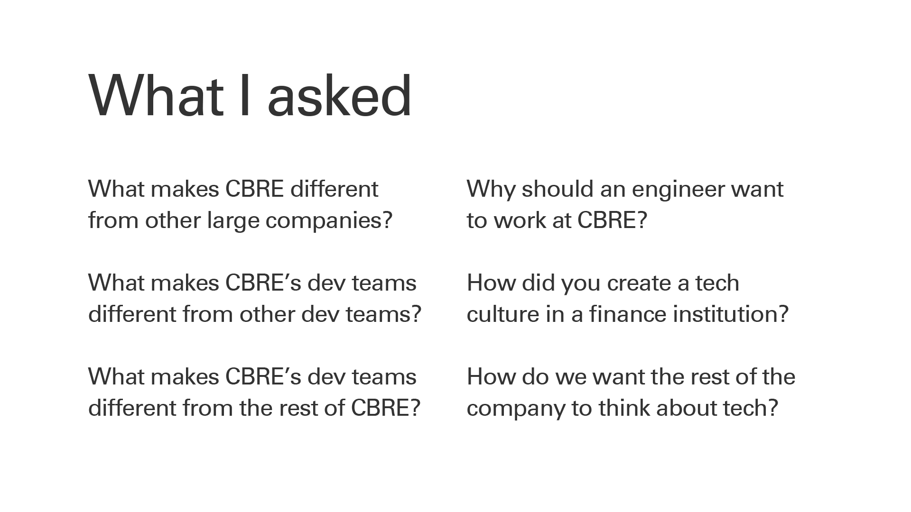
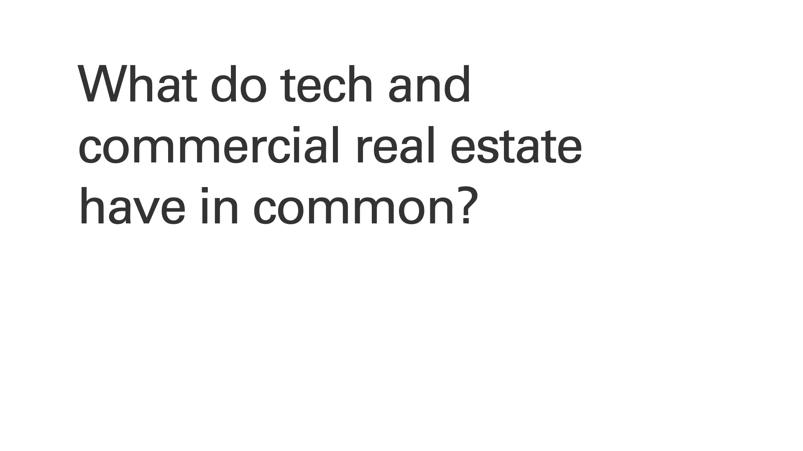

This page is unfinished. More content coming soon.

[My Medium post about the story and design details of this project](https://medium.com/cbrebuild/how-we-made-cbre-build-part-1-d303f0b5fd6d?source=friends_link&sk=8afab89c487068da9e37e67e4fdb96ba)

[CBRE Build reviewed on Brand New](https://www.underconsideration.com/brandnew/archives/new_logo_and_identity_for_cbre_build_done_in_house.php)

## What it is

 Deep, research-driven identity design, interior design, web design, and event design to reposition <Link to='/work/floored-brand'>Floored</Link>, a startup with two products and an idiosyncratic culture, in its new home: the IT organization of CBRE, the <i>Fortune</i> 150 enterprise that acquired it.

In 2016, Floored, the quirky startup I’d helped build for 4 years, was acquired by CBRE, the world’s biggest commercial real estate firm. Our brilliant team, scrappy Chelsea office, and vibrant culture were unchanged, but now that we were part of a globally-recognized brand, it was only natural that we’d let go of the name, visuals, and logo of Floored.

We soon found that with them went our power to recruit technologists, as well as something more troubling: our team's sense of self. I recognized this unmooring as an identity crisis, and self-initiated a project to solve it. 

<figure>

<GatsbyImage image={imageByName(props, 'recruiting-cbre', true)} alt="A sampling of CBRE's broker-centric recruiting materials." />
<GatsbyImage image={imageByName(props, 'recruiting-tech', true)} alt="A sampling of recruiting materials from tech companies." />

<figcaption>Recruiting images from CBRE, left, and top tech companies, right. They depict very different work-worlds.</figcaption>
</figure>

We needed a new identity, and it had many jobs to do: to celebrate and befit this new phase of our evolution, to restore our power to attract great talent, to unite us with CBRE’s disparate product teams across the world, and to position us within CBRE’s IT arm as makers rather than fixers. In short, it needed to to renew and claifty our purpose, and to and express that to our parent company — and to ourselves.

## What I did
- **Pitched the brand in a one-on-one session with CEO Bob Sulentic,** who approved the work enthusiastically, including special praise for my presentation skill, storytelling and slides.

<figure>
      <GatsbyImage image={imageByName(props, 'bob-the-builder', true)} alt="CBRE CEO Bob Sulentic poses for a smile at the NYC CBRE Build office, in front of a glass wall covered in our circuitmap brand graphics." />
      <figcaption>CBRE CEO Bob Sulentic poses for a smile at the NYC CBRE Build office.</figcaption>
</figure>

- Interviewed dozens of people across CBRE and the globe — including brokers, IT professionals, managers, makers of maps and presentations, C-level executives, and tech recruits who rejected our offers — to learn what makes CBRE unique, its values, and its point of view on technology.
- Summarized and presented my findings to peers and executives. The results were that CBRE offered a uniquely great value proposition for technologists: to have the best of both worlds, startup and corporate. We could draw on the resources of an enormous company with troves of data and global reach to do product work with the goal of, as one CBRE executive put it, “changing the organization’s DNA”. And if we succeeded in using technology to change the way CBRE operated, then we’d effectively be changing an entire industry. 

<figure style="text-align: center">
      
      <figcaption>Slides from my  brand research presentation.</figcaption>
</figure>

- Led by the research, I chose _build_ as the center of the new identity. It’s a word common to the worlds of real estate and technology: both kinds of developers go to work every day to build something. 

<figure style="text-align: center">
      
      <figcaption>Slides about the rationale behind the "build" identity.</figcaption>
</figure>

- Working with CBRE’s global heads of marketing and technology, I iterated on visual concepts that fused elements of real estate and tech, extending CBRE’s existing brand and values for a new audience.

<figure>
      <GatsbyImage image={imageByName(props, 'posters0', true)} alt="" />
      <GatsbyImage image={imageByName(props, 'posters1', true)} alt="" />
      <figcaption>A whole bunch of posters I created in visual exploration of the nascent Build brand.</figcaption>
</figure>

- Created a unique and extensible illustration style and personally vector-drew at least a hundred hours’ worth of characters, icons, and one incredibly complicated pattern.

<WidthBleeder style={{marginBottom:0}}>
<CarouselProvider
      naturalSlideWidth={900}
      naturalSlideHeight={600}
      totalSlides={5}
      visibleSlides={1}
      step={1}
      isIntrinsicHeight={true}
>
      <Slider>
            <Slide index={0}>
                  <video loop autoplay playsinline muted width="100%">
                        <source src="./party.mp4" type="video/mp4" />
                  </video>
            </Slide>
            <Slide index={1}>
                  <GatsbyImage image={imageByName(props, 'style-guide', true)} alt="Pages from the Build brand style guide."/>
            </Slide>
            <Slide index={2}>
                  <video loop autoplay playsinline muted width="100%">
                        <source src="./builder-gifs.mp4" type="video/mp4" />
                  </video>
            </Slide>
            <Slide index={3}>
                  <GatsbyImage image={imageByName(props, 'swag', true)} alt="Build swag, including duffel bags and enamel pins."/>
            </Slide>
            <Slide index={4}>
                  <GatsbyImage image={imageByName(props, 'slides', true)} alt="Slide templates with various Build graphics."/>
            </Slide>
      </Slider>
      <ButtonBack />
      <ButtonNext />
      <DotGroup showAsSelectedForCurrentSlideOnly={true}/>
</CarouselProvider>
</WidthBleeder>
<figcaption>Some of the final Build brand materials.</figcaption>

- Worked with architects, signmakers, contractors, print shops, and our own developers to bring the brand to life as environmental graphics, room signage, a new website, countless swag items, and convention booths.

<WidthBleeder style={{marginBottom:0}}>
<CarouselProvider
      naturalSlideWidth={900}
      naturalSlideHeight={600}
      totalSlides={3}
      visibleSlides={1}
      step={1}
      isIntrinsicHeight={true}
>
      <Slider>
            <Slide index={0}>
                  <GatsbyImage image={imageByName(props, 'office0', true)} alt="" />
            </Slide>
            <Slide index={1}>
                  <GatsbyImage image={imageByName(props, 'signs', true)} alt="" />
            </Slide>
            <Slide index={2}>
                  <GatsbyImage image={imageByName(props, 'office1', true)} alt="" />
            </Slide>
      </Slider>
      <ButtonBack />
      <ButtonNext />
      <DotGroup showAsSelectedForCurrentSlideOnly={true}/>
</CarouselProvider>
</WidthBleeder>
<figcaption>Scenes from the CBRE Build NYC office.</figcaption>

## What went well
- The new identity did its job: it positioned us within CBRE as a software innovation lab, not an IT department; it galvanized our team as mission-driven technologists with a big opportunity to make change in a corporate environment; and it gave CBRE a voice that to communicate that opportunity to recruits, who responded with excitement CBRE had never previously been able to stir up.

<figure>
      <GatsbyImage image={imageByName(props, 'booths', true)} alt="" />
      <figcaption>CBRE's booths at college recruiting fairs, before and after the Build brand was introduced.</figcaption>
</figure>

- Got written up positively on _Brand New_, the design world’s foremost branding blog, and checking off a personal bucket list item.

<figure>
      <GatsbyImage image={imageByName(props, 'brand-new', true)} alt="CBRE Build featured on Brand New's website." />
</figure>

- The brand took on a life of its own, spreading as technologists across the company breathed their spirit into the identity. Before long, you could find Build in Dallas, Seattle, and India; and in media as varied as papercraft, 3D printing, and even felting.

<figure>
      <GatsbyImage image={imageByName(props, 'brand-life', true)} alt="" />
      <figcaption>Builders bringing the brand alive in varied media.</figcaption>
</figure>

## What I learned
- That discussing the problems you’re solving for with a diverse group of interviewees yields a cheat sheet for the final pitch. When you know how each stakeholder thinks about the problem, it’s easy to communicate the design as a thoughtful solution built from their input, rather than a blob of creative voodoo.
- The power of discovery interviews to “socialize” new ideas, find hidden stakeholders, build a coalition, and create enthusiasm and momentum for a project.
- That educating the client about design interests them, helps them understand its value, and pulls them into the project. For example, explaining that graphic design's goal is not to "make it look pretty," but to manage communication and perception, elevates the conversation and the quality of the feedback.
- I purposefully made the visuals as crazy as possible from the get-go, figuring that the project would inevitably be canned, so I might as well have fun with it. But my enthusiasm shone through the work, which I think helped buoy it to success. It taught me that lightness of spirit is a key ingredient for success.
## What I’d do differently next time
- I’d learn more about organizational structure our team fit into, and design the brand to reflect that, instead of myopically crafting a solution to our little group’s problems.
- I’d work with CBRE leadership to determine Build's relationship to the rest of CBRE’s tech teams, creating a change management plan that would help the brand spread in an organized, sustainable way. 
- I’d take a less auteurish approach, building a bigger team to tackle the huge volume of execution work on illustrations, guidelines, and documents. 
